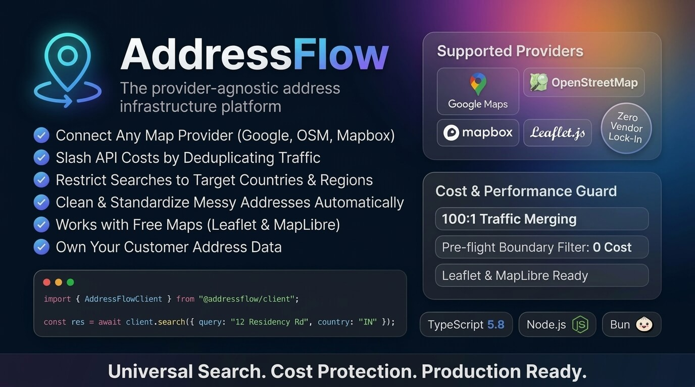

# AddressFlow

> Provider-agnostic address infrastructure for modern applications.



AddressFlow sits between applications and location providers (Google Maps Platform, OpenStreetMap/Nominatim, Mapbox) to provide deterministic normalization, automatic request deduplication (traffic merging), tenant-owned address persistence, geographic boundary cost guards, and native geospatial map visualization.

## Key Features

- **Provider-Agnostic Abstraction**: Switch or failover between Google Maps and 100% Free OpenStreetMap/Nominatim without changing client code.
- **Geographic Boundary & Cost Guard**: Pre-flight checks prevent out-of-boundary queries from generating expensive upstream API calls.
- **Automatic Request Deduplication (Traffic Merging)**: 100 simultaneous requests for the same address share a single provider call.
- **Deterministic Normalization**: Versioned Unicode NFKC string normalizer with abbreviation expansion.
- **Leaflet.js & MapLibre GL Ready**: Native GeoJSON formatters and map helpers (`@addressflow/map-helpers`).
- **Application-Owned Data**: Decouples application address records from third-party provider IDs.
- **Usage & Cost Optimization Analytics**: Transparent visibility into deduplicated requests, application hits, and provider request reductions.
- **BSL 1.1 + MIT Client SDK Licensing**: Permissive client SDKs with protected open-core server engine converting to AGPLv3 after 4 years.

## Repository Packages
- `packages/types`: Canonical Address, GeoJSON, and Provider types
- `packages/core`: Normalization engine, Geoguard, Request Deduplicator, Router
- `packages/providers/nominatim`: 100% Free OpenStreetMap provider
- `packages/providers/google`: Google Maps Places (New) & Geocoding provider
- `packages/providers/mapbox`: Mapbox Places Geocoding v5 provider
- `packages/providers/mock`: Offline testing mock provider
- `packages/server`: PostgreSQL & Redis persistence, rate limiting, and orchestrator
- `packages/client`: TypeScript Client SDK
- `packages/map-helpers`: Leaflet and MapLibre adapters
- `apps/api`: REST API server (`/v1/...`)

## Documentation
Documentation and full integration guides are hosted externally on our official website.

## Quick Start & Verification
```bash
pnpm install
pnpm build
pnpm test
pnpm typecheck
```

